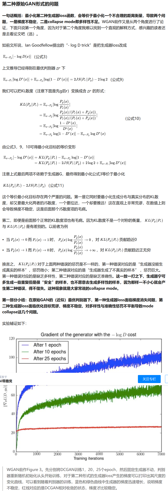

### Real-Time Single Image and Video Super-Resolution Using an EfficientSub-Pixel Convolutional Neural Network ###
这篇文章主要提出了一种不同于反卷积的图像超分辨率方法，传统的反卷积或者分数卷积通过一个卷积核，对输入图像的像素间进行0填充来进行图像超分，效果较差。所以论文提出根据放大的```scale r```，使用r^2个卷积核分别学习一个低分辨率的图像，并且进行组合，如图1,由于分别用卷积核学习不同位置的超分结果，效果较好


### Brain image registration using dual-supervised fully convolutional networks ###
1. 这篇文章的主要创新点在于提出了Fill Gap Unet，结构如图2
2. 使用了传统方法的形变场作为label，并且提出了衡量配准后的图像与template图像相似性的损失，使用这两个损失来训练，从而得到比传统形变场更好的结果。
3. 在Unet上结构引入了多级label，从而加快并稳定训练。


### Generative Adversarial Networks ###
Ian Goodfellow的惊世之作，提出了生成对抗网络，生成对抗网络的公式为


生成器从随机分布z映射到G(z)，判别器的任务是最大化该损失函数，由于D(x)范围0~1,所以该损失函数最大为0，从而D(x)对于label分布x的输出为1，D(G(z))对于生成器映射的输出为0，生成器的任务是最小化该损失，使得D(G(z))的输出为1，生成对抗网络在网络容量无限的情况下，可以收敛到最优解，即判别器输出为0.5，生成器输出G(z)与x分布相同。
该理论证明如下：


收敛性证明如下：


相对熵，也称为KL散度，衡量两个分布的对数差在p上的期望值，设p(x),q(x)是离散随机变量X中取值的两个概率分布，则p对q的相对熵为KL(p||q)=\sigma_x p(x)log(p(x)/q(x))

熵，H(p) = - \sigma_x p(x)log(p(x))，是对于某个分布p的最优编码长度

交叉熵，H(p,q)，是使用分布q的编码来编码真实分布p，H(p,q)=- \sigma_x p(x)log(q(x))

KL散度可以简化为KL(p||q) = - \sigma_x p(x)log(q(x)) + \sigma_x p(x)log(p(x))
从而简化为H(p,q)-H(p)，含义是使用分布q的编码比最有编码多用的比特数

香农距离, JSD(p||q)=1/2(KL(p||(p+q)/2)+KL(q||(p+q)/2)),
JSD(p||q) = 0.5 * (\sigma_x p(x)log(p(x)/(p(x)+q(x))/2) + \sigma_x q(x)log(q(x)/(p(x)+q(x))/2))


### Towards Principled Methods for Training GenerativeAdversarial Networks ###
这篇论文分析了为什么原始的GAN训练起来比较困难
<br/>当p与q没有交集时，香农距离达到最大值log2, 因此对于生成对抗网络来说，判别器最大化
Expectation_x(log(D(x)))+Expectation_z(log(1-D(G(z))))，等价于最小化-Expectation_x(log(D(x)))+Expectation_z(log(1-D(G(z))))，该公式的最小值为
2log2 - JSD(p||q), 最小值在p/(p+q)处取到，因此，当p与q没有交集时，判别器损失为0，即判别器训练到最优时，如果p与q没有交集，那么Expection_z log(1-D(G(z))) = log2，为常数，因此无法训练生成器。
该论文也分别分析了p与q是是离散概率以及p与q是低维流形时，两者概率没有交集，总存在最优的判别器，这种情况在实际训练中经常发生，所以原始形式的损失函数使得生成器得到的梯度为0，不容易训练。
<br/>另外一种为了避免生成器损失为0的损失函数，



### Wassersteine GAN ###
这是上一篇作者的后续著作，作者提出使用Earth-move距离来作为GAN训练的损失函数，Earth-Move距离公式如下
<br/>

<br/>
代表着在所有的p跟q的联合分布里，两者差距最小的距离，可以理解为，在所有p土堆跟q土堆的联合分布里，使用最小的做功来使得p土堆跟q土堆一致，所以称之为推土机距离，相比于香农距离，该距离能够提供稳定且有意义的梯度。并且根据已有的定理，如果判别器的函数满足Lipschitz条件，那么该距离可以表示成<br/>

<br/>
作者给出了WGAN的一个算法，但是参数裁剪会造成一些问题(论文里说clip weight设置过大需要训练时间过长，clip weight设置过小容易梯度消失)

### Improved Training of Wasserstein GANs ###
使用gradient pernality替代了clip weight

### Layer Normalization ###
没看懂，CNN好像不适合用Layer Normalization

### Group Normalization ###
这篇文章详细的总结了batch normalization, layer normalization, instance normaliztion, group normalization的不同，总的来说，对于一个形状为NCHW的输入，(卷积神经网络)batch normalization计算NHW的均值跟方差，layer normalization计算CHW的均值跟方差，instance noramlization计算HW的均值跟方差，group把channel分为几组，计算group组的CHW，在学习参数lambda跟beta时，大家都是学习channel同等数量的值。batch normalization有一点特殊的在于，由于每次都是用随机的batch，因此具有一定的泛化效果，另外 除了batch normalization时在测试时使用frozen的值，其他的都是当场计算的。
作者说group nomalization性能超越 layer normalization 和instance  normalization，并且当group内channnel数是channel数或者1时，分别达到layer normalization和instance normalization的效果。
另外,batch normalization在batch 为1时可以近似看成是instance normalization.

